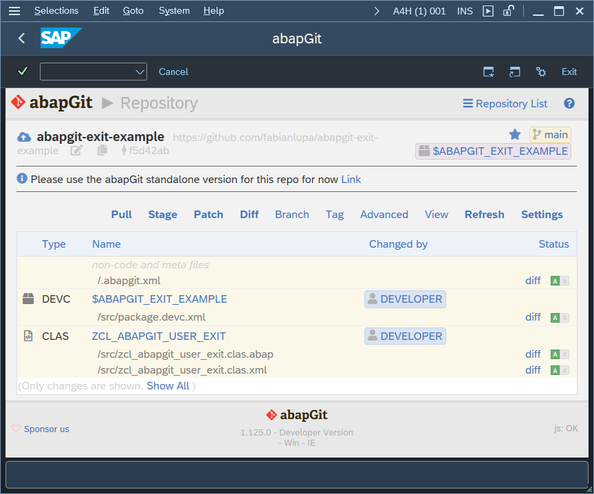
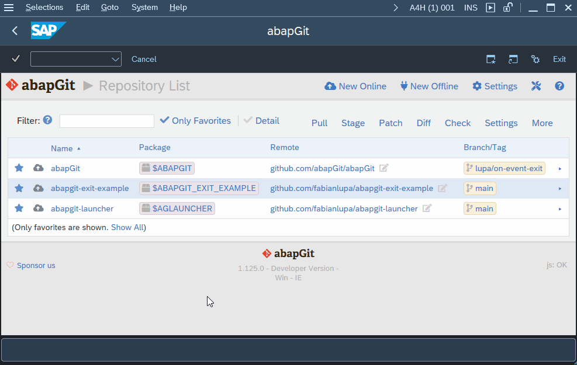

# abapgit-exit-example

Example implementation of abapGit exits to manage multiple installations

Note: This implementation is just for reference. Only one `ZCL_ABAPGIT_USER_EXIT` class can exist in a system. Do not accidently overwrite your existing exit implementation by pulling this repo.

## Screenshots

### WALL_MESSAGE_REPO exit implementation to adjust the header with a message and link

### ON_EVENT exit implementation to override the repo navigation

